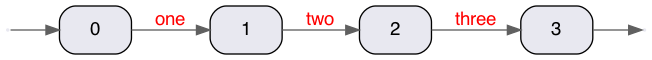

[](https://clojars.org/lt.jocas/lucene-text-analysis)
[](https://cljdoc.org/d/lt.jocas/lucene-text-analysis/CURRENT)
[](https://github.com/dainiusjocas/lucene-text-analysis/actions/workflows/test.yml)

# lucene-text-analysis

Library to inspect the output of the [Lucene](https://lucene.apache.org) text analysis pipeline.  

Supports 3 ways of analyzing text:
- string to list of strings;
- String to list of tokens (similar to the Elasticsearch/Opensearch `_analyze` API);
- string to GraphViz program to draw a Lucene `TokenStream` as a graph.

## Quickstart

Dependencies:
```clojure
{:deps {lt.jocas/lucene-text-analysis {:mvn/version "1.0.4"}}}
```

Code:
```clojure
(require '[lucene.custom.text-analysis :as analysis])

(analysis/text->token-strings "Test TEXT")
;; => ["test" "text"]

(analysis/text->tokens "Test TEXT")
;; => 
[#lucene.custom.text_analysis.TokenRecord{:token "test",
                                          :type "<ALPHANUM>",
                                          :start_offset 0,
                                          :end_offset 4,
                                          :position 0,
                                          :positionLength 1}
 #lucene.custom.text_analysis.TokenRecord{:token "text",
                                          :type "<ALPHANUM>",
                                          :start_offset 5,
                                          :end_offset 9,
                                          :position 1,
                                          :positionLength 1}]

(analysis/text->graph "Test TEXT")
;; =>
"digraph tokens {
   graph [ fontsize=30 labelloc=\"t\" label=\"\" splines=true overlap=false rankdir = \"LR\" ];
   // A2 paper size
   size = \"34.4,16.5\";
   edge [ fontname=\"Helvetica\" fontcolor=\"red\" color=\"#606060\" ]
   node [ style=\"filled\" fillcolor=\"#e8e8f0\" shape=\"Mrecord\" fontname=\"Helvetica\" ]
 
   0 [label=\"0\"]
   -1 [shape=point color=white]
   -1 -> 0 []
   0 -> 1 [ label=\"test / Test\"]
   1 [label=\"1\"]
   1 -> 2 [ label=\"text / TEXT\"]
   -2 [shape=point color=white]
   2 -> -2 []
 }
 "
```

Every function accepts a Lucene `Analyzer` as the second argument.

## Use cases

- Do ASCII folding person names:

With helper library:
```clojure
lt.jocas/lucene-custom-analyzer {:mvn/version "1.0.14"}
```

```clojure
(require '[lucene.custom.analyzer :as custom-analyzer])

(lucene.custom.text-analysis/text->token-strings 
  "Thomas Müller" 
  (custom-analyzer/create {:token-filters [{:asciiFolding {}}]}))
;; => ["Thomas" "Muller"]
```

## How to draw a graph image?

The example assumes that the GraphViz `dot` program is installed:

```shell
clojure -M --eval '(require `lucene.custom.text-analysis)(println (lucene.custom.text-analysis/text->graph "one two three"))' | dot -Tpng -o docs/assets/images/token-graph.png
```
Results in an image



## Development

Compile Java classes:

```shell
clojure -T:build compile-java
```

Start your REPL.

## License

Copyright &copy; 2022 [Dainius Jocas](https://www.jocas.lt).

Distributed under The Apache License, Version 2.0.
